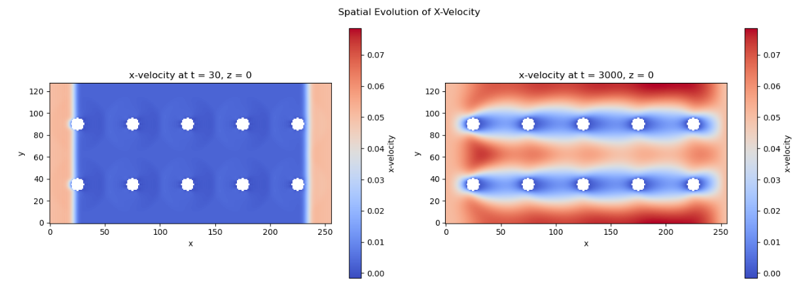
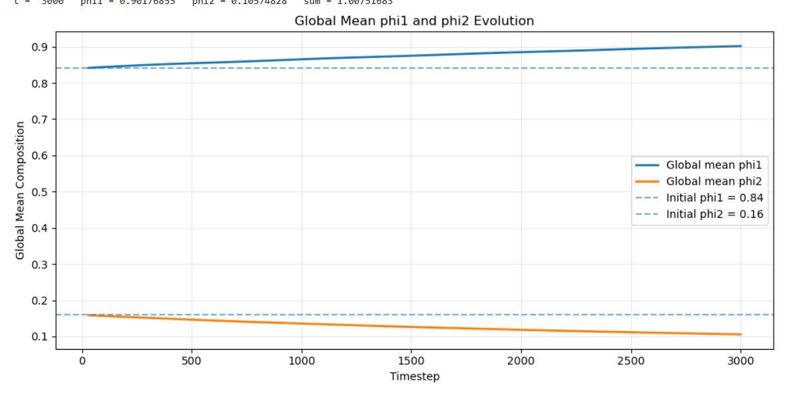

# LOHC Phase-Field / Lattice-Boltzmann Simulation

Simulation report for a two-composition phase-field system transported through a catalyst-packed domain. The case combines a lattice-Boltzmann flow model, Flory–Huggins free energy, and a catalyst-localized surface reaction.

[Open the complete interactive report](https://samibuttvk-star.github.io/lohc-phase-field-lbm-report/)

## Case overview

| Item | Setting |
|---|---|
| Domain | `256 × 128 × 4` lattice cells |
| Runtime | `3000` timesteps |
| Catalyst geometry | 10 pellets in two rows |
| Fluid model | BGK lattice Boltzmann, `tau = 0.8` |
| Thermodynamics | Flory–Huggins phase-field model |
| Initial composition | `phi1 = 0.84`, `phi2 = 0.16` |
| Reaction | Component 3 converted to component 2 near Q6-activated rock cells |
| Boundary velocity | `ux = 0.05` on both x-faces |

## Highlights

- The local composition responds differently at the monitored inlet and outlet cells.
- The global mean `phi1` rises while `phi2` falls, consistent with the configured conversion.
- The mean x-velocity exhibits a damped transient before approaching the imposed-flow range.
- Flow accelerates around the five catalyst columns, producing persistent peaks in the time-averaged velocity profile.
- The global mean `phi1 + phi2` drifts to approximately `1.0075`; this should be considered when assessing numerical conservation.

## Repository contents

- `index.html` — self-contained report for GitHub Pages
- `docs/simulation-report.md` — Markdown version of the report
- `docs/report.css` — report stylesheet
- `figures/` — input screenshots and result visualizations

## View locally

Open `index.html` directly in a browser. No build step or external dependency is required.

## Reproducibility status

This repository documents the case configuration and analyzed results. It does **not** currently include the simulation executable/source, `packed_bed.h5`, raw timestep outputs, or plotting scripts. Consequently, the published materials support inspection of the setup and results but not a complete rerun.

## Interpretation note

All reported quantities are in lattice or simulation units unless stated otherwise. The results are numerical outputs from the configured case and should not be treated as experimentally validated LOHC reactor performance.

## Full documentation

See the [Markdown simulation report](docs/simulation-report.md) or open the GitHub Pages site generated from `index.html`.
