# LOHC Phase-Field / Lattice-Boltzmann Simulation in a Catalyst-Packed Domain

The simulation studies a two-composition phase-field system transported through a catalyst-packed domain. The reaction is localized near the solid catalyst through the built-in **Q6 rock activation**, with component 3 converted into component 2; in the output naming used here, this corresponds to **phi2 -> phi1**. The hydrodynamics are solved with a lattice-Boltzmann formulation, while the composition fields evolve with the phase-field model.

# 1. Simulation input

The simulation was run on a **256 × 128 × 4** lattice for **3000 timesteps**. The main input parameters are shown below.

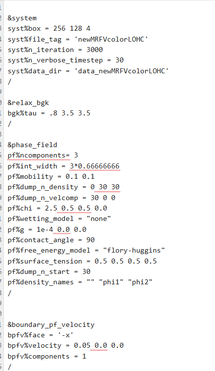

**Figure 1.** Main system, relaxation, and phase-field input parameters.

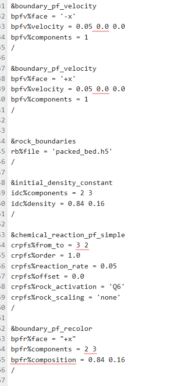

**Figure 2.** Boundary conditions, catalyst geometry, initial composition, reaction, and recoloring input.

## 1.1 Main numerical parameters

| Parameter | Value | Meaning |
|---|---:|---|
| Domain size | `256 × 128 × 4` | Size of the lattice domain |
| Number of timesteps | `3000` | Total simulation time |
| Verbose interval | `30` | Progress information printed every 30 timesteps |
| Fluid BGK relaxation time | `0.8` | Controls momentum relaxation and fluid viscosity |
| Phase-field relaxation times | `3.5, 3.5` | Relaxation of the two phase-field distributions |
| Number of phase-field components | `3` | Base fluid plus two composition fields |
| Interface width | `3 × 0.66666666 ≈ 2` | Width of the diffuse interface in lattice units |
| Mobility | `0.1, 0.1` | Controls diffusion of the two composition fields |
| Free-energy model | `Flory-Huggins` | Describes non-ideal interactions between the composition fields |
| Body force | `(10^-4, 0, 0)` | Small force in the positive x-direction |
| Wetting model | `none` | No active wetting model was used |
| Contact angle | `90°` | Neutral contact-angle value in the input |

For the fluid, the BGK relaxation time can be related to the kinematic viscosity by

$$
\nu=\frac{\tau_f-0.5}{3}.
$$

With $\tau_f=0.8$,

$$
\nu=\frac{0.8-0.5}{3}=0.1
$$

in lattice units.

The phase-field densities and x-velocity were saved every **30 timesteps**, giving output at $t=30,60,90,\ldots,3000$.

---

# 2. Thermodynamic model and parameter choices

## 2.1 Flory-Huggins free energy

The simulation uses the **Flory-Huggins free-energy model** to describe the interaction between the two phase-field components.

The input values are

```text
pf%chi = 2.5  0.5  0.5  0.0
```

which correspond to

$$
\chi_{11}=2.5, \qquad
\chi_{12}=\chi_{21}=0.5, \qquad
\chi_{22}=0.
$$

In simple terms:

- $\chi_{11}=2.5$ gives the strongest interaction contribution for the first phase-field component.
- $\chi_{12}=0.5$ gives a moderate coupling between $\phi_1$ and $\phi_2$.
- $\chi_{22}=0$ means that no additional self-interaction term is added for the second component.

These values were used as **simulation parameters in lattice units** to control the thermodynamic behavior of the two composition fields.

## 2.2 Surface-tension coefficients

The input uses

```text
pf%surface_tension = 0.5  0.5  0.5  0.5
```

All four coefficients are equal to **0.5**. This keeps the interfacial treatment symmetric, so no phase-field combination is given a stronger surface-tension contribution than another.

The value `0.5` provides a moderate interfacial contribution while keeping the diffuse interface numerically resolved on the lattice.

## 2.3 Mobility

The two mobilities are

$$
M_1=M_2=0.1.
$$

Mobility controls how quickly the phase-field composition can diffuse and smooth spatial gradients. Equal values were used so that both phase-field components have the same mobility setting.

## 2.4 Wetting and contact angle

The input contains

```text
pf%wetting_model = "none"
pf%contact_angle = 90
```

The wetting model is disabled, so no extra wall-wetting correction is applied. The value of $90^\circ$ represents a neutral contact-angle setting in the input.

## 2.5 Body force

A small force is applied in the positive x-direction:

$$
\mathbf{g}=(10^{-4},0,0).
$$

This force acts in the same direction as the imposed flow and provides an additional driving force inside the domain.

---

# 3. Catalyst geometry

The catalyst geometry is read from

```text
packed_bed.h5
```

The domain contains **ten catalyst pellets**, arranged in two rows of five. Their x-locations are approximately

$$
x=25,\;75,\;125,\;175,\;225,
$$

with the two rows near $y=35$ and $y=90$.

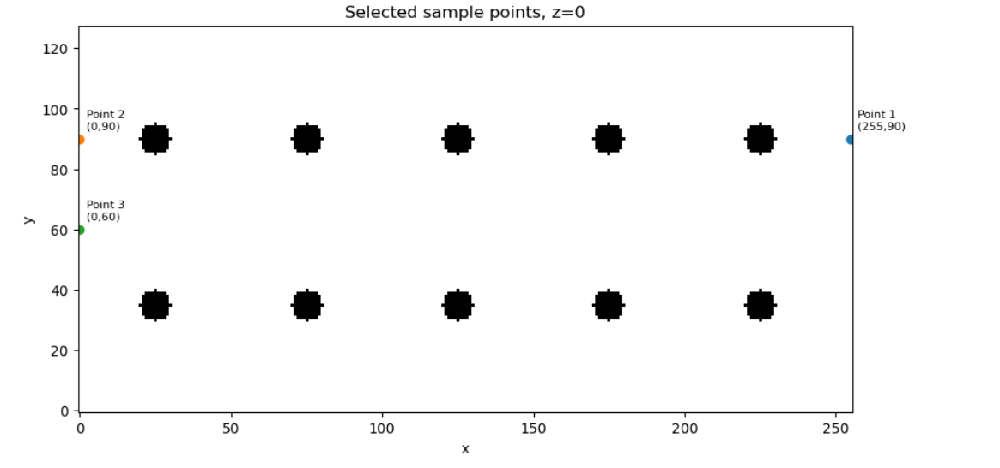

**Figure 3.** Catalyst arrangement on the $z=0$ plane and the monitored locations used in the local plots.

The solid catalyst cells are masked when fluid quantities are plotted or averaged.

---

# 4. Initial conditions

The initial phase-field composition is

$$
\phi_1=0.84,
\qquad
\phi_2=0.16,
$$

so initially

$$
\phi_1+\phi_2=1.
$$

The fluid starts from rest:

$$
u_x=u_y=u_z=0.
$$

The velocity field therefore has to develop from the imposed boundary conditions and body force after the simulation starts.

---

# 5. Boundary conditions

## 5.1 Velocity boundary conditions

The same x-directed velocity is imposed on both x-boundaries:

```text
-x face:  u = (0.05, 0, 0)
+x face:  u = (0.05, 0, 0)
```

Therefore,

$$
u_x(x=0)=0.05,
\qquad
u_x(x=L_x)=0.05.
$$

The important point is that the right side is also a **velocity boundary**, not an open pressure outlet. The fluid initially starts from zero velocity inside the domain, while both x-boundaries are set to $u_x=0.05$. Because of this, the velocity field develops from both sides during startup.

The overall flow is still in the positive x-direction. The interior velocity and pressure then adjust while the fluid moves through the catalyst bed.

## 5.2 Recoloring boundary

At the positive-x boundary, the recoloring condition is

```text
components  = 2 3
composition = 0.84 0.16
```

This keeps the boundary composition at approximately

$$
(\phi_1,\phi_2)=(0.84,0.16).
$$

This is why the monitored point at the positive-x boundary remains at the original composition during the simulation.

---

# 6. Surface reaction model

The reaction input is

```text
crpfs%from_to         = 3 2
crpfs%order           = 1.0
crpfs%reaction_rate   = 0.05
crpfs%offset          = 0.0
crpfs%rock_activation = 'Q6'
crpfs%rock_scaling    = 'none'
```

The saved phase-field components correspond to a conversion of

$$
\boxed{\phi_2 \rightarrow \phi_1}.
$$

The reaction is first order. In simple form, the conversion rate is proportional to the local amount of $\phi_2$:

$$
r\propto k\phi_2,
\qquad k=0.05.
$$

For example, if $\phi_2=0.16$ at an activated location, the corresponding nominal conversion scale is

$$
0.05\times0.16=0.008.
$$

The `Q6` rock activation restricts the reaction to fluid cells close to the catalyst surface. This represents a surface catalytic reaction instead of a reaction acting uniformly throughout the fluid.

---

# 7. Local composition results

## 7.1 Evolution of $\phi_1$

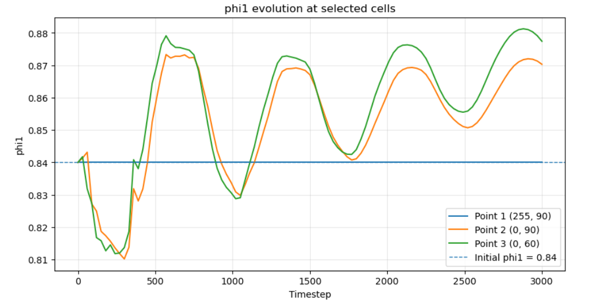

**Figure 4.** Evolution of $\phi_1$ at the monitored cells.

At the positive-x recoloring boundary, $\phi_1$ stays at **0.84**. At the other two monitored locations, $\phi_1$ first decreases and then increases above its initial value. The long-term increase is consistent with the reaction converting $\phi_2$ into $\phi_1$.

## 7.2 Evolution of $\phi_2$

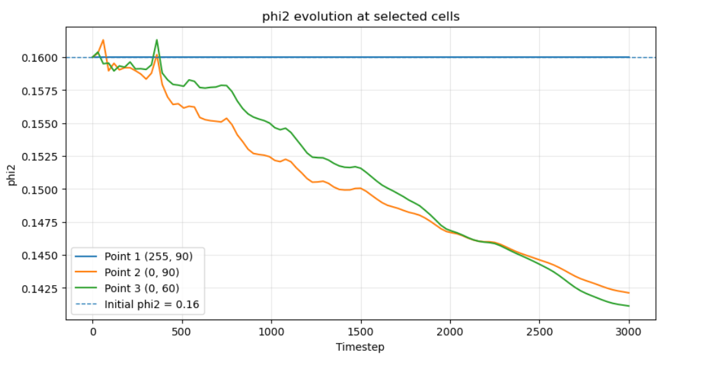

**Figure 5.** Evolution of $\phi_2$ at the monitored cells.

At the positive-x boundary, $\phi_2$ remains at **0.16**. At the other monitored locations, $\phi_2$ gradually decreases and reaches about **0.142** and **0.141** at the end of the run. This agrees with $\phi_2$ being consumed by the reaction.

## 7.3 Local $\phi_1+\phi_2$

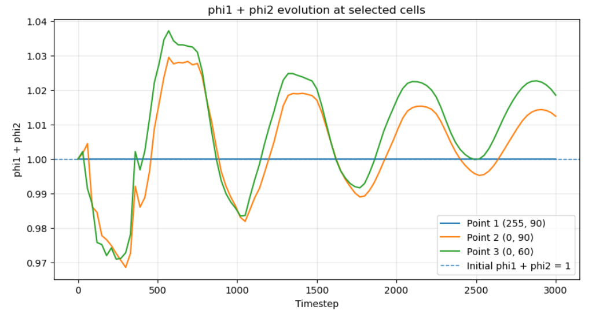

**Figure 6.** Local evolution of $\phi_1+\phi_2$.

At the recolored boundary, the sum stays equal to **1**. At the other monitored cells, the sum oscillates around 1 because the local composition is affected by reaction, transport, and phase-field redistribution.

### Characteristic local values

| Quantity | Point 1 `(255,90,0)` | Point 2 `(0,90,0)` | Point 3 `(0,60,0)` |
|---|---:|---:|---:|
| $\phi_1$ final | 0.840000 | 0.870302 | 0.877418 |
| $\phi_2$ final | 0.160000 | 0.142125 | 0.141129 |
| $(\phi_1+\phi_2)$ final | 1.000000 | 1.012427 | 1.018547 |

---

# 8. Local velocity evolution

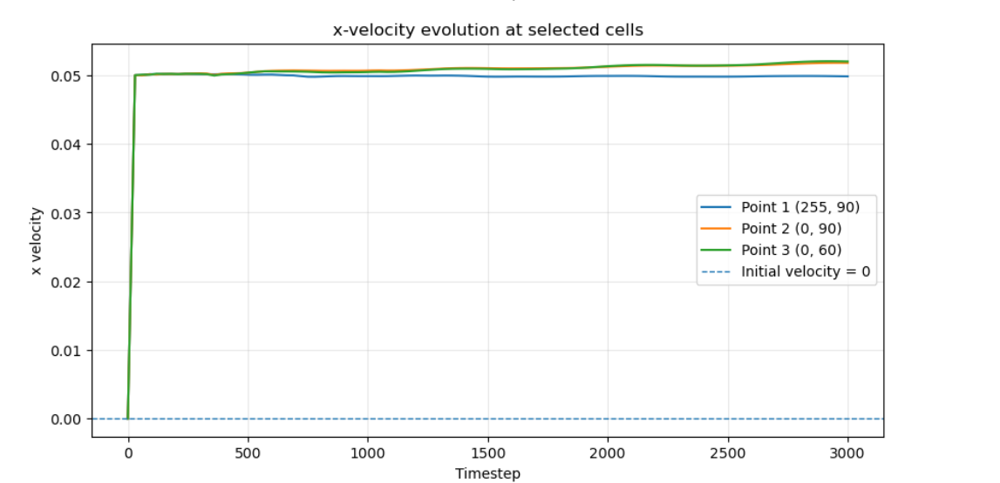

**Figure 7.** x-velocity at the monitored cells.

All three monitored cells lie on the prescribed x-velocity boundaries, where the input value is **0.05**. The saved velocity, however, is the force-corrected macroscopic lattice-Boltzmann velocity rather than a direct copy of the boundary parameter. It is calculated as

$$
u_x=\frac{j_x+\frac{1}{2}F_x}{\rho},
$$

where $j_x$ is the x-directed momentum, $F_x$ is the local x-directed force, and $\rho$ is the total fluid density. Because the force correction is included, the reported boundary velocity can differ slightly from **0.05**. This explains why Points 2 and 3 rise a little above the imposed value, while Point 1 stays very close to it.

The final values are approximately:

- Point 1: $u_x\approx0.0498$
- Point 2: $u_x\approx0.0518$
- Point 3: $u_x\approx0.0520$

---

# 9. Global phase-field evolution

## 9.1 Global mean $\phi_1$ and $\phi_2$


**Figure 8.** Global mean $\phi_1$ and $\phi_2$ in the fluid cells.

The global results clearly show the intended reaction direction:

- mean $\phi_1$ increases from about **0.84** to **0.9018**,
- mean $\phi_2$ decreases from about **0.16** to **0.1057**.

At $t=3000$,

$$
\langle\phi_1\rangle\approx0.9018,
\qquad
\langle\phi_2\rangle\approx0.1057.
$$

This shows that $\phi_2$ is being converted into $\phi_1$ during the simulation.

## 9.2 Global mean $\phi_1+\phi_2$

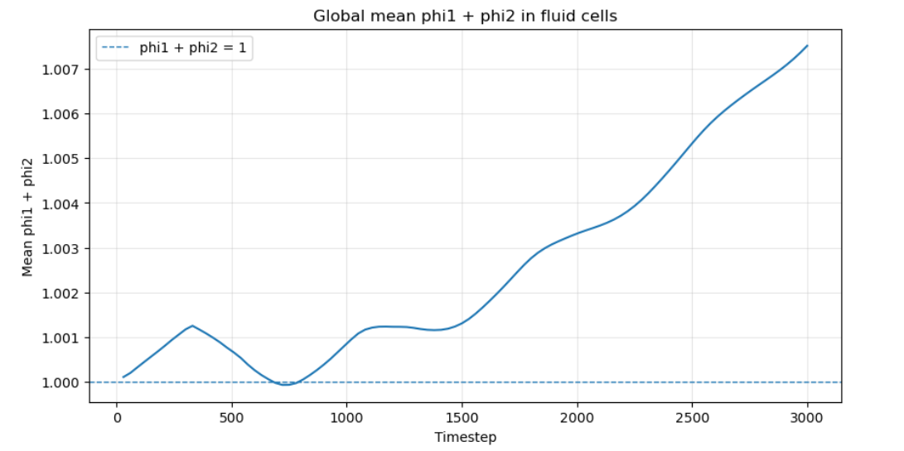

**Figure 9.** Global mean of $\phi_1+\phi_2$ in the fluid cells.

The total composition stays close to 1 for most of the simulation but slowly increases at later times. At $t=3000$,

$$
\langle\phi_1+\phi_2\rangle\approx1.0075.
$$

This is about **0.75% above 1**, so the total composition remains close to the expected value but shows a small positive drift over the full run.

---

# 10. Global velocity evolution

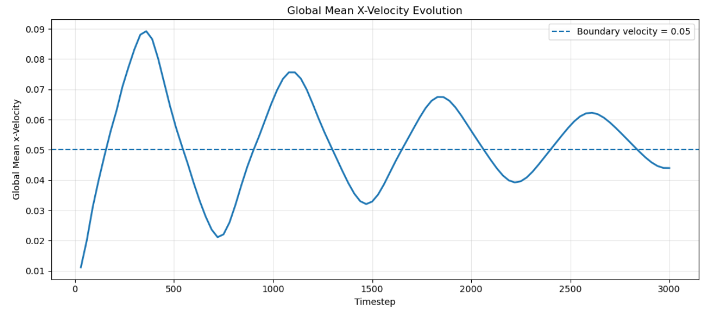

**Figure 10.** Global mean x-velocity in the fluid cells.

The global mean x-velocity shows an **oscillatory startup response** before moving toward a more stable flow state.

Initially, the fluid inside the domain is at rest, while both x-boundaries impose

$$
u_x=0.05
$$

and the positive body force also accelerates the fluid. Because the flow is driven suddenly from rest, the mean velocity rises above the imposed boundary value and produces the first **overshoot**, reaching approximately **0.09**.

After this overshoot, the catalyst bed resists the flow and the pressure field builds up. These effects reduce the acceleration, so the mean velocity falls again. The system then continues to adjust between the driving forces and the resistance of the catalyst bed.

As the simulation continues, the oscillations become smaller. This is the **relaxation process** toward a developed porous-flow condition. The oscillations describe changes in the magnitude of the positive x-directed flow; they do not mean that the overall flow reverses direction.

---

# 11. Pressure evolution

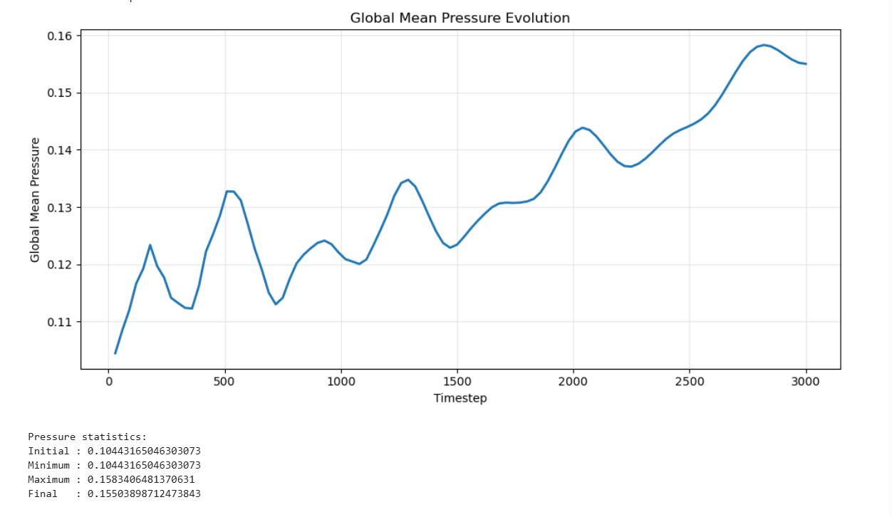

**Figure 11.** Global mean pressure in the fluid cells.

The global mean pressure shows both **oscillations** and an overall upward trend during the simulation.

Both x-boundaries prescribe velocity rather than pressure, so the pressure level is free to adjust while the flow develops. The positive x-directed body force drives the fluid, while the catalyst pellets resist the motion. The pressure field changes to balance these effects.

This is why the pressure rises and falls during startup but still drifts upward overall. It increases from about

$$
0.104
$$

at the beginning to about

$$
0.155
$$

at $t=3000$.

In simple terms, **the pressure adjusts as the driven flow develops through the resistant catalyst bed, and no fixed pressure boundary keeps the mean pressure at one reference value**.

---

# 12. Spatial evolution of the composition fields

## 12.1 Spatial $\phi_1$

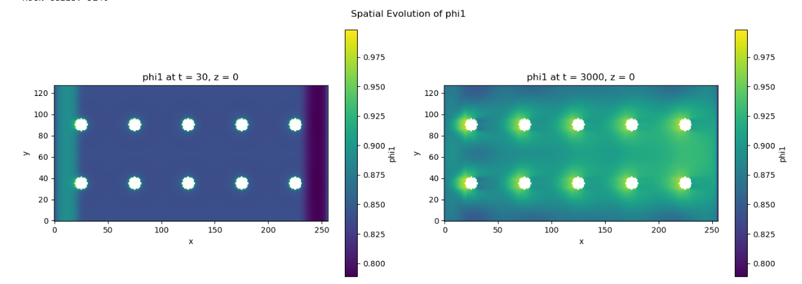

**Figure 12.** Spatial $\phi_1$ field at $t=30$ and $t=3000$ on the $z=0$ plane.

At $t=30$, most of the domain is still close to the initial value of $\phi_1=0.84$. By $t=3000$, $\phi_1$ has increased over much of the fluid domain. Higher values are also visible around the catalyst positions, showing the effect of reaction and transport.

## 12.2 Spatial $\phi_2$

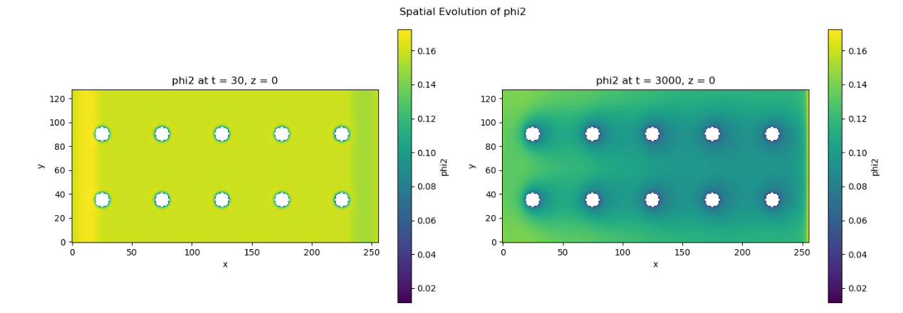

**Figure 13.** Spatial $\phi_2$ field at $t=30$ and $t=3000$ on the $z=0$ plane.

At the start, $\phi_2$ is close to its initial value of **0.16**. By $t=3000$, it is lower throughout most of the domain because it is being consumed by the reaction.

A higher-$\phi_2$ region remains near the positive-x boundary because the recoloring condition keeps the boundary composition close to $(0.84,0.16)$.

---

# 13. Spatial velocity development


**Figure 14.** x-velocity at $t=30$ and $t=3000$ on the $z=0$ plane.

At $t=30$, most of the interior is still close to the zero-velocity initial condition. The regions close to both x-boundaries already respond to the imposed value $u_x=0.05$, so the startup influence is visible from both ends.

By $t=3000$, the velocity field has developed throughout the domain. The catalyst pellets strongly affect the flow:

- fluid close to the catalyst rows moves more slowly,
- low-velocity regions form around and behind the pellets,
- faster flow develops in the open passages above, below, and between the two catalyst rows.

This explains why the final velocity field is not uniform even though the same x-velocity is imposed at both ends.

---

# 14. Spatial pressure field

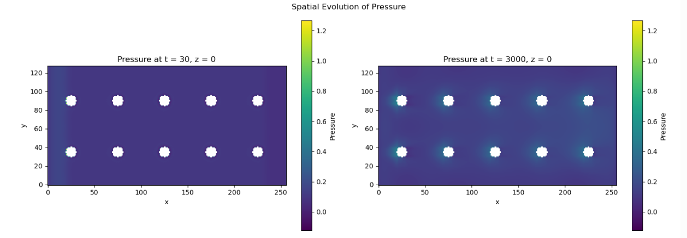

**Figure 15.** Pressure at $t=30$ and $t=3000$ on the $z=0$ plane.

At the beginning, the pressure field is relatively weak and uniform. At $t=3000$, pressure variations can be seen around the catalyst locations because the fluid has to move around the solid pellets.

These local pressure variations are consistent with the overall increase in global mean pressure shown earlier.

---

# 15. Time-averaged x-velocity profile

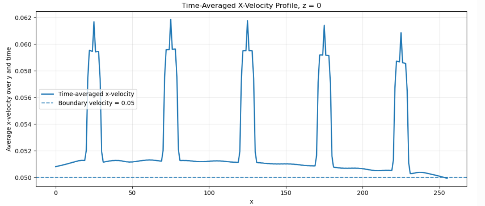

**Figure 16.** y-averaged x-velocity at $z=0$, averaged over all saved snapshots from $t=30$ to $t=3000$.

Away from the catalyst columns, the time-averaged velocity stays close to the imposed value of **0.05**. At the five catalyst-column positions, clear peaks of about **0.059-0.062** appear because the fluid accelerates through the reduced open area around the pellets.

Since the five peaks remain after averaging over the full simulation, they are a persistent effect of the catalyst geometry rather than a temporary fluctuation.
